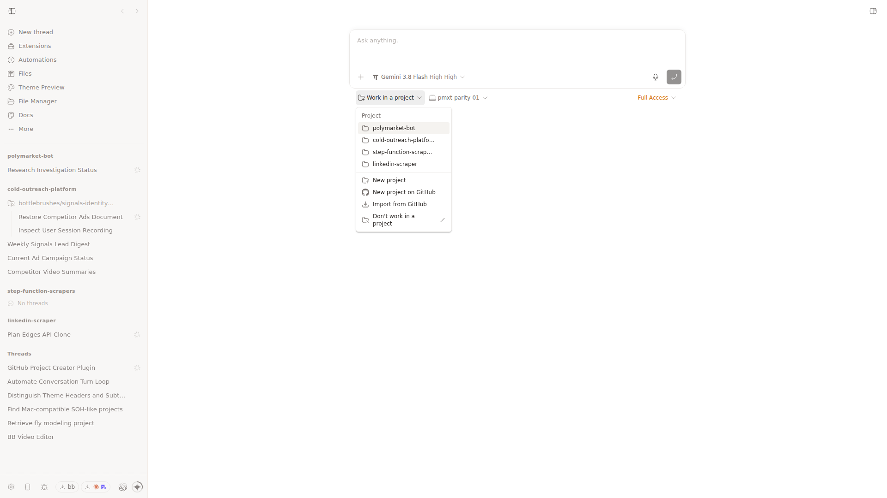
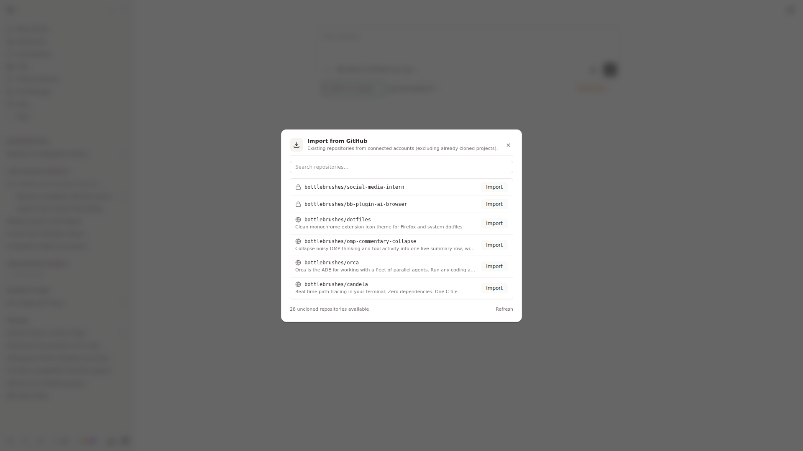

# bb-plugin-github-projects

Create and import GitHub repositories directly from BB's native project picker and CLI.

## Features

- **Native Picker Integration**: Injects dedicated "New project on GitHub" and "Import from GitHub" options directly into BB's project dropdown.
- **One-Line Project Creation**: Quickly create private GitHub repositories with auto-cloning and project registration.
- **Account Repository Import**: Browse and import existing repositories from connected GitHub accounts, automatically filtering out already cloned or registered projects.
- **CLI & Agent Commands**: Manage projects via the `bb gh-project` CLI and agent skill.

## Screenshots

### Native Project Picker Dropdown


### Import from GitHub Modal


## Commands

```bash
# Create a new repository on GitHub and register it in BB
bb gh-project create <name> [--public] [--description <desc>] [--dir <path>]

# Import an existing repository from your connected account
bb gh-project import <owner/repo> [--dir <path>]

# List repositories available for import (excluding already cloned)
bb gh-project available

# List all registered BB projects with their Git remotes
bb gh-project list
```

## Requirements

- GitHub CLI (`gh`) installed and authenticated on the machine running BB.
- Set **Default Projects Directory** in the plugin settings to choose where repositories are cloned. It defaults to `~/Projects` on the BB server machine.
